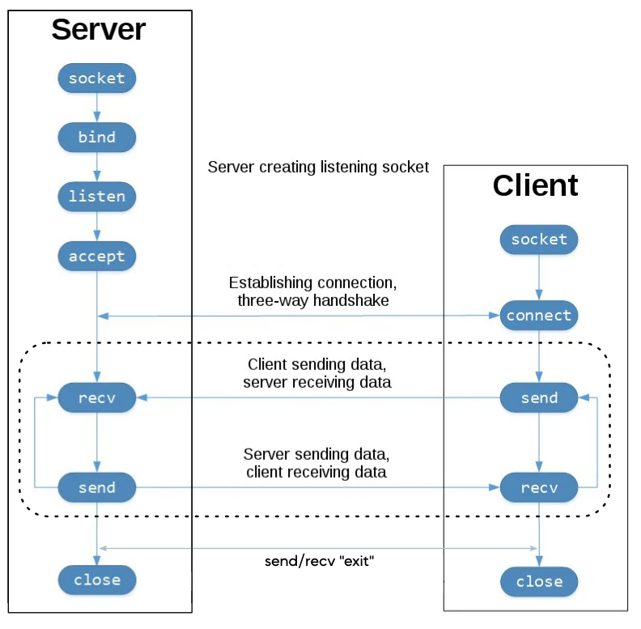

## Implementing a Chat with TCP Sockets
Implement a single Python script that allows two individuals to communicate using TCP sockets. The communication is bidirectional but not simultaneous, meaning one of the two individuals must send a message and the other must receive it, and vice versa (when a message is sent, you switch to receiving; you cannot send again). The script should allow the individuals to communicate indefinitely until one of them decides to end the conversation by writing "exit." At this point, the script's execution ends for both individuals.

<!-- img diagram -->

