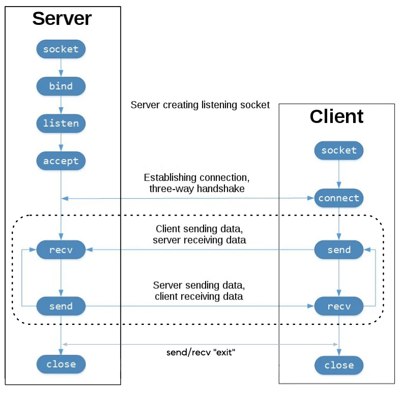

## Ejercicio de implementación de un chat con sockets TCP
Implementar un único script python que permita a dos individuos comunicarse mediante sockets TCP. La comunicación es bidireccional pero no simultánea, es decir, uno de los dos individuos debe enviar un mensaje y el otro debe recibirlo, y viceversa (cuando se envía un mensaje se pasa a recibir, no se puede volver a enviar). El script debe permitir que los individuos se comuniquen de forma indefinida hasta que uno de ellos decida terminar la conversación escribiendo "exit". En este momento, la ejecución del script termina para ambos individuos.

<!-- img diagram -->

